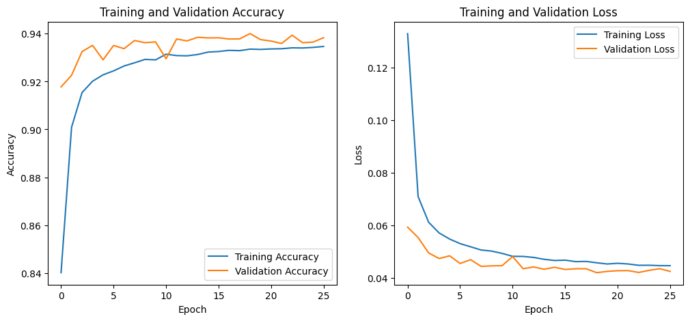
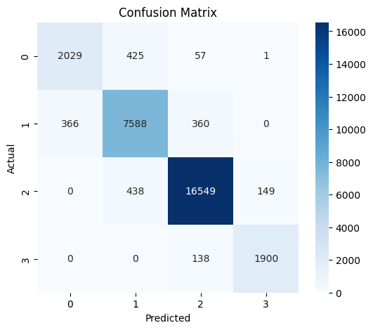
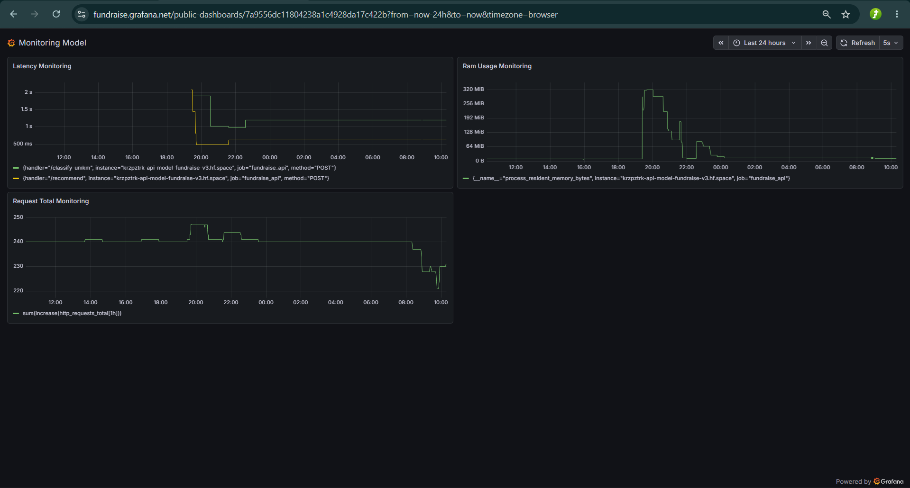

# Fund-AI (AI & Machine Learning Services - Capstone Project)

Layanan Utama AI dan Pipeline Machine Learning untuk aplikasi pendanaan **FundRise** berbasis Python, FastAPI, dan ChromaDB. Sistem ini dirancang sebagai otak kecerdasan buatan dari ekosistem FundRise, menyediakan klasifikasi kelayakan bisnis UMKM, rekomendasi investasi cerdas, ringkasan finansial otomatis, serta *AI Advisor Chatbot* interaktif berbasis arsitektur RAG (Retrieval-Augmented Generation).

> [!CAUTION]
> **NOTE**
> Proyek ini merupakan Capstone Project untuk program Coding Camp 2026 yang diselenggarakan dan didukung penuh oleh DBS Foundation x Dicoding.

---

## Repositori Terkait

Proyek AI Service ini merupakan bagian dari ekosistem aplikasi FundRise. Berikut adalah repositori terkait lainnya:
* **Frontend Application (fund-fe):** [github.com/kelpstones/fund-fe](https://github.com/kelpstones/fund-fe)
* **Backend API (fund-be):** [github.com/kelpstones/fund-be](https://github.com/kelpstones/fund-be)
* **Data Science (fund-ds):** [github.com/kelpstones/fund-ds](https://github.com/kelpstones/fund-ds) *(Repositori khusus Data Preprocessing & Pipeline)*

---

## Fitur Utama

Aplikasi AI Service ini dilengkapi dengan fitur-fitur tingkat lanjut berikut:
* **Sistem Klasifikasi UMKM Pintar (`/classify-umkm`):** Memproses data profil bisnis UMKM menggunakan model berbasis **FT-Transformer** (Feature Tokenizer Transformer) untuk memprediksi kelas risiko dan kelayakan pendanaan secara otomatis.
* **Mesin Rekomendasi Investasi (`/recommend`):** Menggunakan **PolyEns (Polynomial Ensemble)** dan *Cosine Similarity* untuk mencocokkan profil investor dengan proposal UMKM aktif (diambil via *Backend API*), serta memberikan skor kecocokan dalam persentase.
* **Financial Summary Generator (`/generate-financial-summary`):** Mengintegrasikan LLM untuk membaca data *metrics* finansial UMKM dan menghasilkan ringkasan naratif secara otomatis.
* **AI Advisor Chatbot (RAG System):** Asisten virtual bertenaga **Google Gemini API** yang terintegrasi dengan **ChromaDB Vector Database**. Chatbot ini memiliki *Dual-Persona* (Customer Service & Business Advisor) untuk menjawab pertanyaan operasional dan memberikan saran teknis.
* **Monitoring Terpusat & Ekspor Metrik:** Mengekspos *endpoint* Prometheus yang langsung dikirim ke instance **Grafana Cloud** melalui *Remote Write* untuk visualisasi metrik secara *real-time*.

---

## 🧠 Deskripsi Model Utama (Klasifikasi UMKM)

Sistem **Core ML API** untuk klasifikasi UMKM dilatih secara end-to-end dan ditenagai oleh arsitektur **FT-Transformer (Feature Tokenizer Transformer)**. Model ini secara khusus dirancang untuk memproses data tabular (tabel) dengan mengadopsi mekanisme pembelajaran canggih dari bidang *Natural Language Processing* (NLP).

### 1. Komponen Arsitektur Keras (Subclassing)
* **FeatureTokenizer:** Mengubah data fitur numerik menjadi token (vektor). Layer ini juga menambahkan token khusus `[CLS]` yang bertugas merangkum dan menyimpan seluruh informasi dari fitur UMKM.
* **TransformerBlock:** Menggunakan mekanisme *Multi-Head Attention* (3 blok Transformer) untuk mempelajari pola dan korelasi antar-fitur. Blok ini membantu model mengetahui metrik mana yang paling krusial dalam menentukan tingkat risiko bisnis.
* **Klasifikasi Akhir:** Menggunakan representasi akhir dari token `[CLS]` yang dilewatkan ke *Layer Normalization* dan *Dense Layer* untuk memprediksi 4 tingkatan risiko UMKM (*Critical, Struggling, Growth, Elite*).

### 2. Strategi Training & Penanganan Class Imbalance
* **Focal Loss (gamma=2.0):** Digunakan sebagai fungsi *loss* kustom untuk menurunkan fokus model pada kelas data mayoritas yang mudah ditebak, sehingga model dipaksa belajar lebih keras mengenali kelas minoritas.
* **Custom Threshold (0.6):** Pada tahap inferensi, probabilitas batas bawah sebesar `0.6` diterapkan khusus untuk memprediksi kelas **Elite** guna menjaga akurasi pada kelas minoritas tertinggi ini.
* **Early Stopping & Smart Callback:** Proses *training* dihentikan secara otomatis pada Epoch ke-26 karena tidak ada perbaikan pada *validation loss* selama 7 epoch berturut-turut, memastikan model terhindar dari *overfitting*.

### 3. Efisiensi & Performa Evaluasi
* **Efisiensi Parameter:** Model beroperasi secara sangat ringan. Berdasarkan hierarki arsitekturnya, *FT-Transformer* ini hanya membutuhkan **110.468 *trainable parameters*** (sekitar 431 KB memori).
* **Akurasi Akhir:** Berhasil mencetak tingkat akurasi sebesar **93.55%** pada pengujian *test dataset*, dengan *F1-Score* yang sangat konsisten di seluruh spektrum kelas risiko.

<details>
<summary><b>Lihat Detail Arsitektur FT-Transformer (Model Summary)</b></summary>

```text
Model: "ft_transformer_4"
┏━━━━━━━━━━━━━━━━━━━━━━━━━━━━━━━━━┳━━━━━━━━━━━━━━━━━━━━━━━━┳━━━━━━━━━━━━━━━┓
┃ Layer (type)                    ┃ Output Shape           ┃       Param # ┃
┡━━━━━━━━━━━━━━━━━━━━━━━━━━━━━━━━━╇━━━━━━━━━━━━━━━━━━━━━━━━╇━━━━━━━━━━━━━━━┩
│ feature_tokenizer_6             │ ?                      │         1,088 │
│ (FeatureTokenizer)              │                        │               │
├─────────────────────────────────┼────────────────────────┼───────────────┤
│ transformer_block_18            │ ?                      │        33,472 │
│ (TransformerBlock)              │                        │               │
├─────────────────────────────────┼────────────────────────┼───────────────┤
│ transformer_block_19            │ ?                      │        33,472 │
│ (TransformerBlock)              │                        │               │
├─────────────────────────────────┼────────────────────────┼───────────────┤
│ transformer_block_20            │ ?                      │        33,472 │
│ (TransformerBlock)              │                        │               │
├─────────────────────────────────┼────────────────────────┼───────────────┤
│ layer_normalization_48          │ (64, 64)               │           128 │
│ (LayerNormalization)            │                        │               │
├─────────────────────────────────┼────────────────────────┼───────────────┤
│ sequential_27 (Sequential)      │ (64, 4)                │         8,836 │
└─────────────────────────────────┴────────────────────────┴───────────────┘
 Total params: 110,468 (431.52 KB)
 Trainable params: 110,468 (431.52 KB)
 Non-trainable params: 0 (0.00 B)
```
</details>

<details>
<summary><b>Lihat Laporan Evaluasi Klasifikasi & Confusion Matrix</b></summary>

```text
              precision    recall  f1-score   support

           0       0.85      0.81      0.83      2512
           1       0.90      0.91      0.91      8314
           2       0.97      0.97      0.97     17136
           3       0.93      0.93      0.93      2038

    accuracy                           0.94     30000
   macro avg       0.91      0.90      0.91     30000
weighted avg       0.94      0.94      0.94     30000
```
*Catatan: Kelas 3 (Elite) tetap mencetak skor presisi dan recall yang sangat tinggi (0.93) meskipun memiliki data minoritas terbanyak. Hal ini membuktikan efektivitas penggunaan Focal Loss dan Custom Threshold pada proses pelatihan.*


*(Kurva akurasi dan loss yang stabil membuktikan model terhindar dari overfitting).*



**Analisis Matriks:** Sebaran tebakan akurat terpusat kuat pada garis diagonal utama. Kesalahan klasifikasi sangat minim dan hanya meleset ke kelas yang saling bersebelahan secara logis. Model terbukti sangat memahami urutan tingkatan risiko (contoh: Kelas 0 hampir tidak pernah diprediksi terbalik menjadi Kelas 3).
</details>

---

## ⚙️ Deskripsi Model Sekunder (Klasifikasi Investor)

Selain model utama untuk UMKM, sistem ini ditenagai oleh model sekunder untuk mengklasifikasikan dan mencocokkan profil investor. Model ini menggunakan pendekatan **Ensemble Voting Classifier** yang menggabungkan beberapa algoritma *machine learning* untuk menghasilkan prediksi yang lebih stabil dan kuat.

### 1. Feature Engineering & Algoritma
* **Polynomial Features:** Menggunakan transformasi derajat ke-2 (`degree=2`) untuk mengekstraksi dan menangkap pola hubungan non-linear antar metrik finansial investor.
* **Ensemble Learning (Soft Voting):**
  * **Extra Trees Classifier:** Memproses pola kompleks dengan tingkat randomisasi tinggi untuk menghindari *overfitting*.
  * **K-Nearest Neighbors (KNN):** Melakukan klasifikasi berbasis jarak (*distance-weighted*) terhadap 7 profil terdekat.
  * **HistGradientBoosting Classifier:** Algoritma *boosting* yang sangat efisien untuk meminimalkan *error* prediksi secara bertahap.

### 2. Performa Evaluasi Investor
Melalui pengujian ketat dengan *Stratified K-Fold Cross Validation* (5 Folds), model klasifikasi investor ini mencetak **Akurasi Validasi sebesar 91.02%** dan **F1-Macro sebesar 86.68%**. Integrasi ke dalam *Pipeline Scikit-Learn* (`PolyEns.joblib`) memastikan sistem rekomendasi FundRise dapat berjalan *real-time* dengan meminimalisasi *training-serving skew*.

<details>
<summary><b>Lihat Laporan Evaluasi Model Sekunder (Investor)</b></summary>

```text
==================================================
VALIDATION DATA RESULT
==================================================
Accuracy : 0.9102
F1 Macro : 0.8668

Classification Report:
              precision    recall  f1-score   support

           0       0.85      0.81      0.83      2010
           1       0.91      0.88      0.89      6651
           2       0.94      0.94      0.94     13708
           3       0.74      0.87      0.80      1631

    accuracy                           0.91     24000
   macro avg       0.86      0.88      0.87     24000
weighted avg       0.91      0.91      0.91     24000
```
</details>

---

## Teknologi dan Dependensi Utama

| Teknologi / Library | Deskripsi |
| :--- | :--- |
| **Python (v3.10+)** | Runtime Environment utama untuk komputasi AI & ML |
| **FastAPI** | Framework Web berkinerja tinggi untuk API ML |
| **Uvicorn** | Server ASGI untuk menjalankan aplikasi FastAPI |
| **TensorFlow & Keras** | Implementasi arsitektur FT-Transformer untuk Model UMKM |
| **Scikit-learn & Joblib** | Pengolahan Pipeline (*Preprocessor*) dan Ansambel Model |
| **ChromaDB** | Vector Database lokal untuk sistem RAG Chatbot |
| **Google GenAI (Gemini)** | Large Language Model (LLM) utama untuk AI Advisor dan NLP |
| **Prometheus Instrumentator** | Eksposur metrik latensi dan sumber daya API |

---

## Struktur Direktori Proyek

```text
├── AI-Advisor-FundRaise/              # Modul Asisten Pintar & Chatbot (RAG)
│   ├── fundraise_vectordb/            # Direktori Vector Database (Otomatis terbuat setelah build)
│   ├── .dockerignore                  # Pengecualian file untuk Docker build
│   ├── .env.example                   # Template environment konfig
│   ├── app.py                         # Entry point server Chatbot API
│   ├── build_db.py                    # Script untuk inisialisasi & build ChromaDB
│   ├── Dockerfile                     # Konfigurasi container AI Advisor
│   ├── knowledge_base.json            # Data sumber pengetahuan untuk di-embed ke Vector DB
│   ├── README.md                      # Dokumentasi lokal modul AI Advisor
│   └── requirements.txt               # Dependensi modul AI Advisor
│
├── API-Model-Fundraise-v3/            # Modul Core ML API (Klasifikasi, Rekomendasi, Summary)
│   ├── .env.example                   # Template environment konfig server
│   ├── ai_service.py                  # Layanan fungsi AI terpusat
│   ├── app.py                         # Entry point aplikasi FastAPI utama
│   ├── best_ft_transformer.keras      # File model Neural Network FT-Transformer
│   ├── Dockerfile                     # Konfigurasi container Core ML API
│   ├── pipeline_investor.joblib       # Pipeline Preprocessor untuk Investor
│   ├── pipeline.joblib                # Pipeline Preprocessor untuk UMKM
│   ├── PolyEns.joblib                 # File model Ansambel Polinomial
│   ├── README.md                      # Dokumentasi lokal modul Core ML API
│   └── requirements.txt               # Dependensi modul Core ML
│
├── Logs-Tensorboard/20260601-043953/  # Riwayat log training model untuk TensorBoard
│   └── events.out.tfevents...v2       # File log metrik performa
│
├── Monitoring-Prometheus-FundRaise/   # Konfigurasi Exporter & Monitoring
│   ├── .env.example                   # Template environment konfig
│   ├── Dockerfile                     # Konfigurasi container monitoring
│   └── prometheus.yml                 # Konfigurasi remote_write Grafana Cloud
│
├── assets/                            # Direktori penyimpanan aset gambar & visualisasi
│   ├── confussion_matriks_FT-Transformer.png
│   ├── Dashboard_Grafana_Monitoring.png
│   └── Plot_Loss_dan_Akurasi_FT-Transformer.png
│
├── .gitignore                         # Pengecualian file untuk Git
├── Klasifikasi Investor (Model Sekunder).ipynb # Notebook eksperimen model investor
├── Klasifikasi UMKM (Model Utama).ipynb       # Notebook eksperimen model UMKM
└── README.md                          # Dokumentasi utama proyek AI
```

---

## Petunjuk Setup Environment

Untuk menjalankan proyek ini, Anda perlu menyiapkan konfigurasi *environment* pada masing-masing modul:

### 1. Environment AI Advisor
Masuk ke folder `AI-Advisor-FundRaise` dan salin template `.env.example` menjadi `.env`:
```bash
cp .env.example .env
```
Sesuaikan konfigurasi variabel lingkungan di dalam `.env`:
| Variabel | Deskripsi | Contoh Nilai |
| :--- | :--- | :--- |
| `GEMINI_API_KEY` | API Key dari Google AI Studio untuk akses LLM | `masukkan_gemini_api_key_anda` |

### 2. Environment Core ML API
Masuk ke folder `API-Model-Fundraise-v3` dan salin template `.env.example` menjadi `.env`:
```bash
cp .env.example .env
```
Sesuaikan variabel berikut di dalam `.env` untuk memastikan API berfungsi dengan baik:
| Variabel | Deskripsi | Contoh Nilai |
| :--- | :--- | :--- |
| `GEMINI_API_KEY` | API Key untuk modul *Financial Summary* | `masukkan_gemini_api_key_anda` |
| `BACKEND_URL` | Endpoint Backend utama untuk *fetch* data UMKM master | `https://api.fundraise.com/v1/businesses/all` |
| `API_KEY` | Header otorisasi `x-api-key` untuk request ke Backend | `kunci_rahasia_api_backend` |

---

## Cara Menjalankan Aplikasi

Anda dapat menjalankan kedua layanan (Chatbot & Model API) menggunakan *virtual environment* Python di mesin lokal Anda.

### A. Menjalankan AI Advisor Chatbot (RAG)
1. Buka terminal dan masuk ke direktori modul:
   ```bash
   cd AI-Advisor-FundRaise
   ```
2. Buat dan aktifkan *virtual environment*, lalu instal dependensi:
   ```bash
   python -m venv venv
   source venv/bin/activate  # Windows: venv\Scriptsctivate
   pip install -r requirements.txt
   ```
3. **PENTING: Build Vector Database.** Sebelum menjalankan aplikasi, Anda WAJIB membangun *database* agar RAG dapat berfungsi:
   ```bash
   python build_db.py
   ```
   *(Script ini akan membaca `knowledge_base.json` dan menghasilkan folder `fundraise_vectordb/`)*
4. Setelah database berhasil di-build, jalankan aplikasi chatbot:
   ```bash
   uvicorn app:app --host 0.0.0.0 --port 8001 --reload
   ```

### B. Menjalankan API Model Utama (Core ML)
1. Buka terminal baru dan masuk ke direktori modul:
   ```bash
   cd API-Model-Fundraise-v3
   ```
2. Buat, aktifkan *virtual environment*, dan instal dependensi:
   ```bash
   python -m venv venv
   source venv/bin/activate
   pip install -r requirements.txt
   ```
3. Jalankan server FastAPI:
   ```bash
   uvicorn app:app --host 0.0.0.0 --port 8000 --reload
   ```

---

## Dokumentasi API Lengkap

Layanan AI menyediakan beberapa *endpoint* yang dapat diakses oleh sistem Backend Utama (fund-be).

### 1. Modul AI Advisor (`Port: 8001`)

| Metode | Endpoint | Headers Wajib | Body Request (JSON) | Deskripsi |
| :--- | :--- | :--- | :--- | :--- |
| **POST** | `/chat` | `Content-Type: application/json` | `{"message": "string"}` | Endpoint utama AI Advisor. Merespon dengan *Persona Customer Service* atau *Investment Advisor* berdasarkan pencarian ChromaDB. |
| **GET** | `/health` | - | - | Mengecek status koneksi Gemini API dan ChromaDB. |
| **GET** | `/metrics` | - | - | Endpoint bawaan untuk *scrape* metrik Prometheus (Instrumentator). |

### 2. Modul Core ML API (`Port: 8000`)

| Metode | Endpoint | Headers Wajib | Body Request (JSON) | Deskripsi |
| :--- | :--- | :--- | :--- | :--- |
| **POST** | `/classify-umkm` | `Content-Type: application/json` | `{"net_profit_margin": float, "kepuasan_pelanggan": float, "peak_hour_latency": "string", "review_volatility": float, "repeat_order_rate": float, "digital_adoption_score": float, "year_revenue": int, "business_tenure_years": float}` | Memprediksi ID Kelas Risiko untuk proposal UMKM menggunakan **FT-Transformer**. |
| **POST** | `/recommend` | `Content-Type: application/json` | `{"investor_id": int, "kepuasan_pelanggan": float, "peak_hour_latency": "string", "digital_adoption_score": float, "net_profit_margin": float, "year_revenue": int, "business_tenure_years": float}` | Menghitung Cosine Similarity untuk menghasilkan rekomendasi (skor %) antara preferensi investor dan data UMKM Master. |
| **POST** | `/generate-financial-summary` | `Content-Type: application/json` | *(Sama dengan body `/classify-umkm`)* | Menghasilkan ringkasan naratif (teks AI) mengenai data metrik UMKM. |
| **GET** | `/health` | - | - | Mengecek kelengkapan model Joblib & Keras yang dimuat dalam *memory*. |
| **GET** | `/metrics` | - | - | Endpoint bawaan untuk *scrape* metrik Prometheus. |

---

## Tautan Deployment & Monitoring

Infrastruktur *live* AI FundRise berjalan di atas ekosistem Hugging Face Spaces dan metriknya dipantau menggunakan Grafana Cloud. Konfigurasi `prometheus.yml` telah diatur menggunakan mekanisme `remote_write` langsung ke instance Grafana Prod.

* **API Model Utama:** [Hugging Face - API Model Fundraise v3](https://huggingface.co/spaces/Krzpztrk/API_Model_Fundraise_v3)
* **API Advisor Chatbot:** [Hugging Face - AI Advisor FundRaise](https://huggingface.co/spaces/Krzpztrk/AI-Advisor-FundRaise)
* **API Monitoring (Prometheus):** [Monitoring Prometheus FundRaise](https://huggingface.co/spaces/Krzpztrk/Monitoring-Prometheus-FundRaise)
* **Public Grafana Dashboard:** [Live Dashboard FundRise](https://fundraise.grafana.net/public-dashboards/7a9556dc11804238a1c4928da17c422b?from=now-24h&to=now&timezone=browser)
* **Penyimpanan Cloud Aset Model:** [Google Drive Folder - Model Files](https://drive.google.com/drive/folders/1ARBgCh-3UrBW-yZY1RJW0xTPc5kv0hnt?usp=sharing)

### Visualisasi Monitoring
Kami menggunakan metrik pemantauan tingkat lanjut untuk mencegah masalah stabilitas sistem. Metrik yang dipantau meliputi waktu latensi per *request*, manajemen alokasi memori RAM *container*, dan laju arus data.



## Lisensi

Aplikasi ini dilisensikan di bawah lisensi ISC. Hak cipta dilindungi undang-undang.
